# Alternative Election System
# Systems Analysis and Design
## Draft Analytical Diagrams (DFDs, ERD, and Use Cases)

> **Working Draft**
>
> These diagrams are conceptual and intended to establish the system architecture before implementation.
>
> They should evolve together with the Functional Specification and Architecture Compass.

---

# 1. System Context Diagram (DFD Level 0)

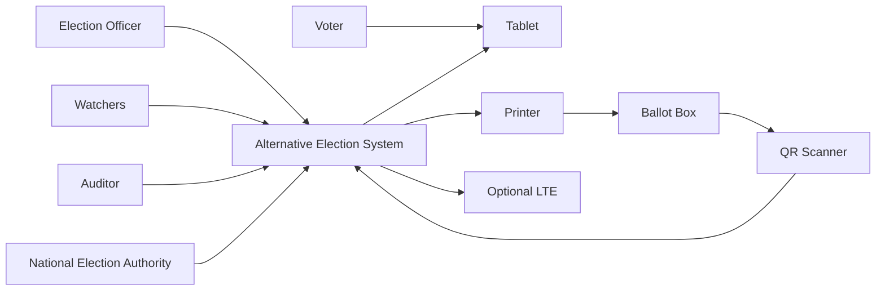

---

# 2. Data Flow Diagram – Level 1

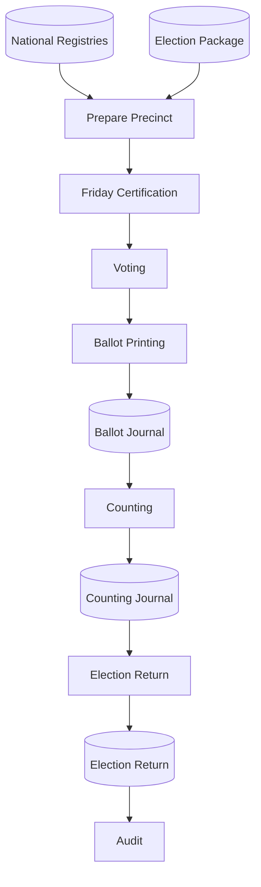

---

# 3. Voting Process (DFD Level 2)

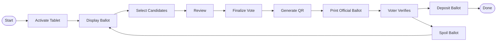

---

# 4. Counting Process (DFD Level 2)

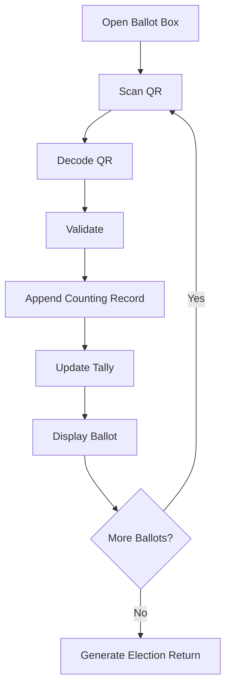

---

# 5. Friday Certification Workflow

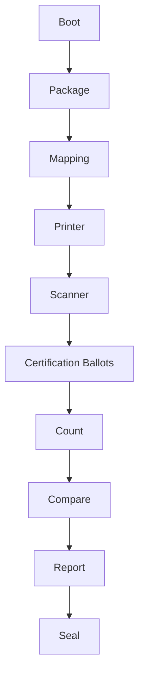

---

# 6. Election Lifecycle State Diagram

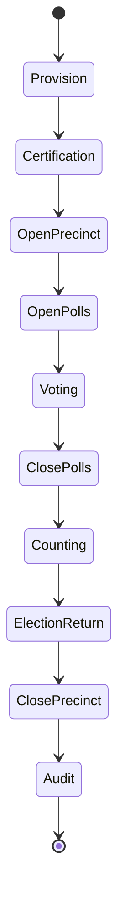

---

# 7. Voting Session State Diagram

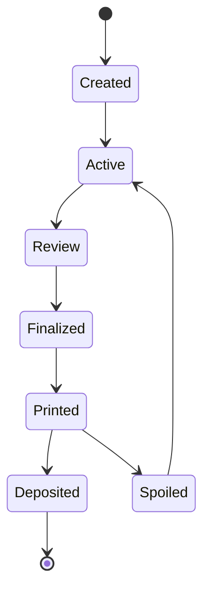

---

# 8. Entity Relationship Diagram (Conceptual)

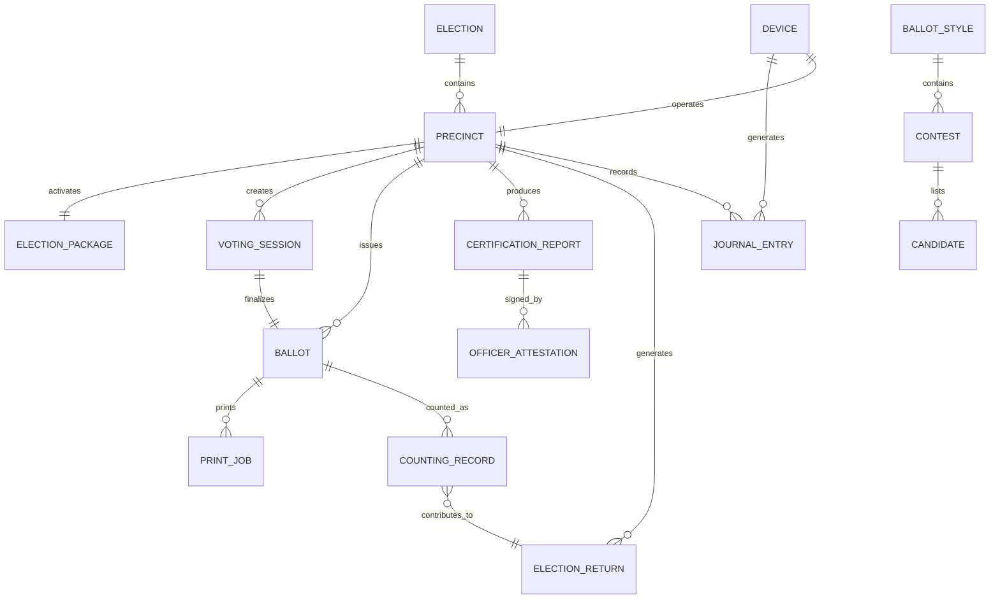

---

# 9. Component Diagram

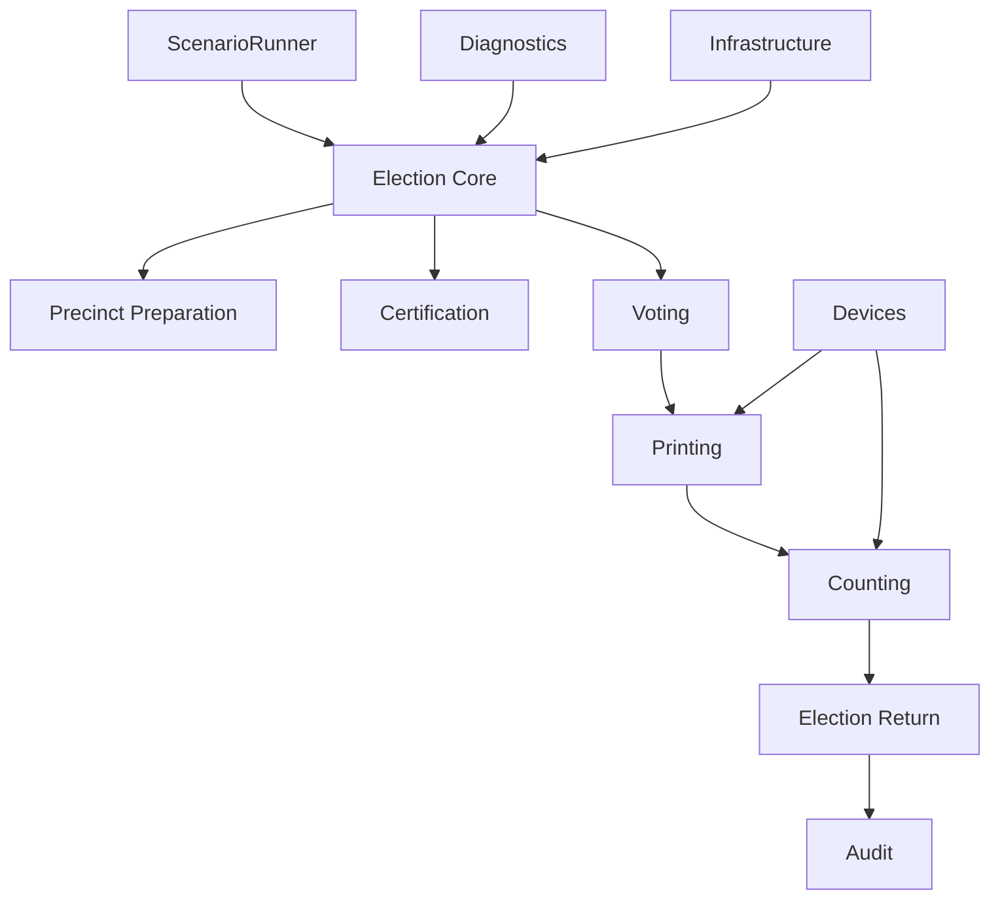

---

# 10. Use Case Diagram (Conceptual)

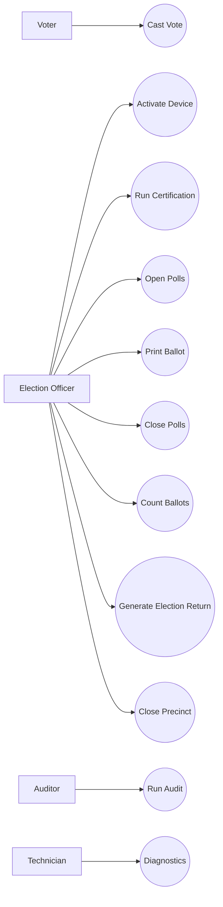

---

# 11. Deployment Diagram (Conceptual)

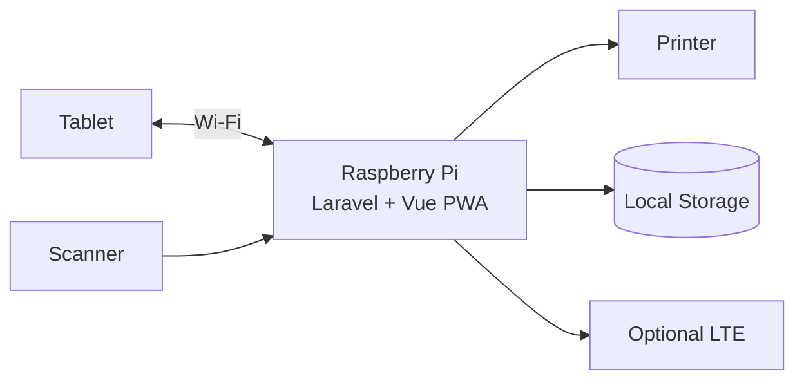

---

# 12. Traceability Overview

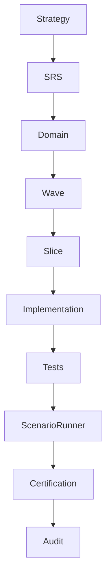

---

# Future Diagrams

The following diagrams are expected to become significantly more detailed during implementation:

- Physical Entity Relationship Diagram
- Sequence Diagrams for every ceremony
- Printer Adapter Sequence Diagram
- QR Generation/Decoding Sequence Diagram
- Backup Appliance Recovery Diagram
- Journal Event Flow Diagram
- Certification Evidence Flow Diagram
- Election Return Generation Flow
- Activity Timeline Diagram
- UI Navigation Map
- Raspberry Pi Hardware Interaction Diagram
- Scenario Runner Execution Graph

These conceptual diagrams provide the analytical foundation upon which the detailed implementation design will be constructed.
