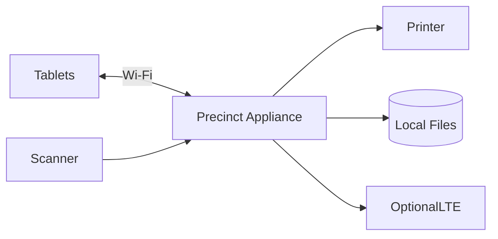
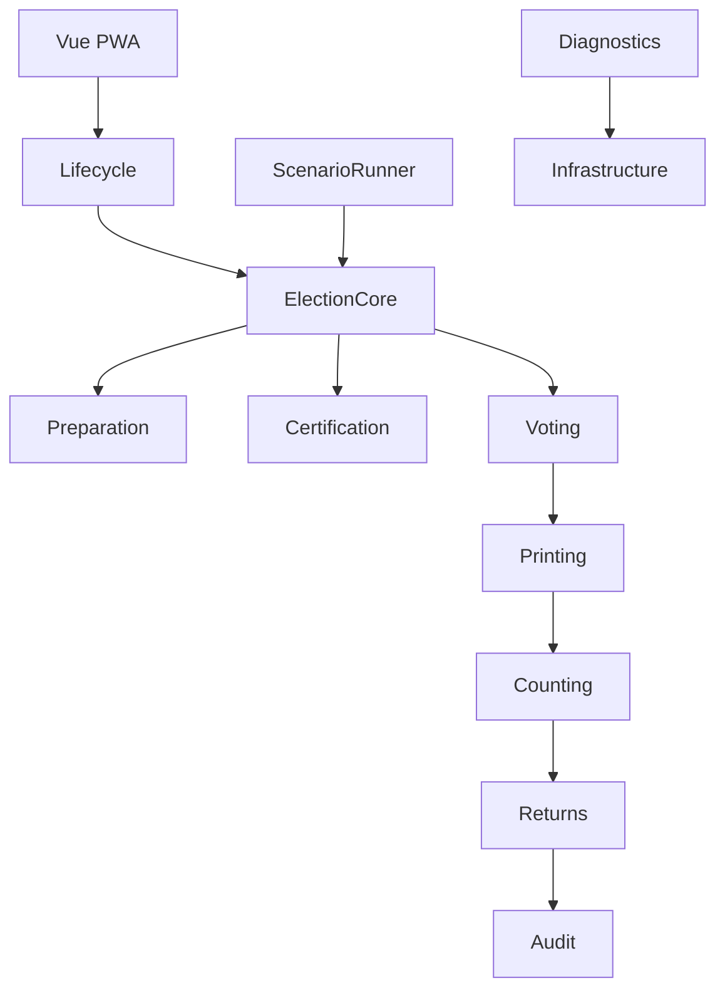
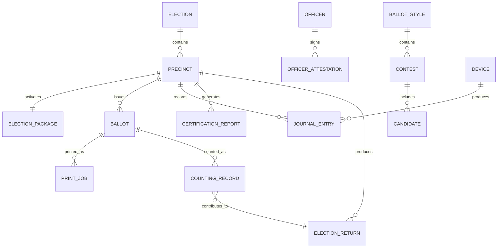
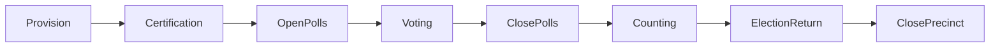

# Alternative Election System
# System Design Specification (SDS)
## Architecture Blueprint, Database Design, Inputs/Outputs, and User Interface Mockups

> **Document Status:** Draft 1.0
>
> This document is the architectural blueprint for implementing the Alternative Election System.
>
> Unlike the System Requirements Specification (SRS), this document focuses on **how the system is organized**, **how its components interact**, and **how users experience the application**.
>
> Source code, database migrations, Laravel classes, Vue components, and implementation tasks will be derived from this document.

---

# Table of Contents

1. Architectural Principles
2. Overall System Architecture
3. Deployment Architecture
4. Domain Architecture
5. Data Storage Strategy
6. System Inputs and Outputs
7. Database Design
8. User Interface Architecture
9. Screen Mockups
10. Navigation Flow
11. Hardware Interaction
12. Reporting Architecture
13. Diagnostics
14. Scenario Runner
15. Future Expansion

---

# 1. Architectural Principles

The system shall be designed according to the following principles.

- Offline-first
- Paper is the legal source of truth
- Raspberry Pi is an appliance, not an authority
- Deterministic execution
- Hardware abstraction
- Ceremony-driven workflow
- Adapter-based architecture
- Progressive Web Application (PWA)
- Recoverable by replacement hardware
- Every important artifact is printable

---

# 2. Overall System Architecture



---

# 3. Internal Architecture



---

# 4. Deployment Layout

```text
Raspberry Pi

├── Laravel
├── Vue PWA
├── Local Storage
├── QR Engine
├── Printer Driver
├── Scanner Driver
├── SQLite (temporary)
├── National Registries
└── Device Services
```

---

# 5. Data Storage Strategy

## Permanent

```text
National Registries

Election Package

Ballot PDFs

Certification Reports

Election Returns

Activity Journal

Counting Journal
```

---

## Temporary

```text
SQLite

Read Models

Search Indexes

Caches

Scenario Execution

Print Queue
```

SQLite never becomes the source of truth.

---

# 6. System Inputs

Inputs include:

```text
Election Package

Officer PIN

Tablet Votes

QR Codes

Certification Ballots

Official Ballots

Printer Status

Scanner Status
```

---

# 7. System Outputs

Outputs include:

```text
Printed Ballot

Election Return

Certification Report

Audit Report

Scenario Report

Diagnostics Report

Journal Entries

QR Codes
```

---

# 8. Database Design (Conceptual)



---

# 9. UI Architecture

The application is ceremony-driven.

No administration dashboard.

No feature menus.

The UI always presents:

- Current Stage
- Current Ceremony
- Next Required Action

---

# 10. Primary Navigation



---

# 11. Home Screen

```text
+------------------------------------------------------+

 Alternative Election System

 Precinct 0421-A

────────────────────────────────────────────────────────

 Current Stage

 READY FOR CERTIFICATION

────────────────────────────────────────────────────────

 ▶ Start Certification

────────────────────────────────────────────────────────

 Timeline

 ✓ Package Loaded

 ✓ Mapping Derived

 ○ Certification Pending

+------------------------------------------------------+
```

---

# 12. Certification Screen

```text
+------------------------------------------------------+

 Friday Certification

────────────────────────────────────────────────────────

 ✓ Election Package

 ✓ Printer

 ✓ Scanner

 ✓ Mapping

 ✓ Certification Deck

 ✓ Election Return

────────────────────────────────────────────────────────

 STATUS

 PASS

────────────────────────────────────────────────────────

 [ Sign Certification ]

+------------------------------------------------------+
```

---

# 13. Voting Screen

```text
+------------------------------------------------------+

 Electronic Ballot

────────────────────────────────────────────────────────

 PRESIDENT

 ○ Candidate A

 ● Candidate B

 ○ Candidate C

────────────────────────────────────────────────────────

 [ Previous ]

 [ Review ]

+------------------------------------------------------+
```

---

# 14. Review Screen

```text
+------------------------------------------------------+

 Review Ballot

────────────────────────────────────────────────────────

 President

 ✓ Candidate B

 Vice President

 ✓ Candidate X

 Mayor

 ✓ Candidate Y

────────────────────────────────────────────────────────

 [ Edit ]

 [ Finalize Vote ]

+------------------------------------------------------+
```

---

# 15. QR Screen

```text
+------------------------------------------------------+

 Present this QR Code

██████████████████

██████████████████

██████████████████

────────────────────────────────────────────────────────

 Proceed to Election Officer

+------------------------------------------------------+
```

---

# 16. Ballot Printing Screen

```text
+------------------------------------------------------+

 Printing Official Ballot

────────────────────────────────────────────────────────

 Printer Ready

 Printing...

██████████████████

────────────────────────────────────────────────────────

 Please wait...

+------------------------------------------------------+
```

---

# 17. Counting Screen

```text
+------------------------------------------------------+

 Official Counting

────────────────────────────────────────────────────────

 Waiting for next ballot...

██████████████████

────────────────────────────────────────────────────────

 Accepted

842

Rejected

0

────────────────────────────────────────────────────────

 Progress

███████████████░░░

+------------------------------------------------------+
```

---

# 18. Election Return Screen

```text
+------------------------------------------------------+

 Counting Complete

────────────────────────────────────────────────────────

 Ballots Counted

842

────────────────────────────────────────────────────────

 [ Generate ER ]

────────────────────────────────────────────────────────

 [ Print ER ]

+------------------------------------------------------+
```

---

# 19. Timeline Screen

```text
+------------------------------------------------------+

 Timeline

────────────────────────────────────────────────────────

08:00 Package Loaded

08:05 Certification Passed

08:15 Polls Opened

17:00 Polls Closed

17:05 Counting Started

17:48 Election Return Generated

17:55 Precinct Closed

+------------------------------------------------------+
```

---

# 20. Diagnostics

```text
+------------------------------------------------------+

 Diagnostics

────────────────────────────────────────────────────────

 Device Status

Printer

Scanner

Storage

Journal

Configuration Hashes

Software Version

────────────────────────────────────────────────────────

 Technician Login Required

+------------------------------------------------------+
```

---

# 21. Hardware Interaction

```mermaid
flowchart LR

Tablet

↓

Voting

↓

QR

↓

Scanner

↓

Printing

↓

Ballot

↓

Ballot Box

↓

Counting Scanner

↓

Election Return
```

---

# 22. Reporting Architecture

```text
Certification Report

↓

Election Return

↓

Audit Report

↓

Diagnostics Report

↓

Scenario Report
```

Every report shall be printable.

---

# 23. Scenario Runner

```mermaid
flowchart TD

Scenario

↓

Runner

↓

Lifecycle

↓

Artifacts

↓

Validation

↓

Certification Report
```

---

# 24. Future Design Deliverables

The following detailed artifacts will be developed during implementation.

- Physical Database Schema
- Laravel Package Structure
- Vue Component Library
- Device Adapter Interfaces
- API Contracts
- Printer Rendering Specification
- QR Payload Specification
- Election Dictionary Specification
- Sequence Diagrams
- Hardware Certification Procedures

---

# Conclusion

The System Design Specification transforms the requirements into an implementable architecture while preserving the project's guiding principles.

The design intentionally minimizes operator complexity, isolates hardware through adapters, and structures the application around election ceremonies rather than administrative functions.

The result is an appliance that is simple to operate, deterministic in behavior, recoverable in the face of hardware failure, and auditable through paper-backed evidence and reproducible digital artifacts.
